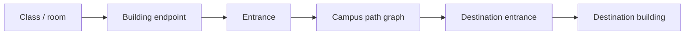

<div align="center">


# Gapwise for UTM

### Make every gap on campus count.

**A privacy-first timetable, gap planner, and campus routing experience built specifically for University of Toronto Mississauga students.**

[](https://gapwise-utm.vercel.app)
[](https://github.com/andrewmuratov/gapwise/actions/workflows/ci.yml)
[](LICENSE)

<sub>React 19 · TypeScript · MapLibre · Supabase · Bun · Vercel</sub>

<br />

**[Live app](https://gapwise-utm.vercel.app)** · **[Privacy](PRIVACY.md)** · **[Security](SECURITY.md)** · **[Contributing](CONTRIBUTING.md)** · **[Campus survey](docs/CAMPUS_SURVEY.md)**

</div>

---

## The idea

UTM schedules are full of small decisions: **where do I go next, how long will it take, and what can I actually do with the time between classes?**

Gapwise turns an ACORN `.ics` export into a readable weekly timetable, identifies usable gaps, and adds route-aware context around the UTM campus — without requiring students to manually rebuild their schedule.

> **Import once. Understand the whole day.**

<table>
<tr>
<td width="33%" valign="top">

### 01 · Import
Drop in an ACORN `.ics` file. Parsing happens locally in the browser.

</td>
<td width="33%" valign="top">

### 02 · Understand
See classes, gaps, travel time, leave-by guidance, and useful windows at a glance.

</td>
<td width="33%" valign="top">

### 03 · Move
Use campus-aware routing between recognized UTM buildings and mapped entrances.

</td>
</tr>
</table>

---

## Built around actual student days

| | Experience |
|---|---|
| 📅 | **ACORN timetable import** — readable weekly and mobile day views from the calendar students already have. |
| ⏳ | **Gap intelligence** — understands the time between classes instead of treating a timetable as a static grid. |
| 🧭 | **UTM routing** — deterministic campus paths with entrance-level endpoints and explicit confidence levels. |
| 🏠 | **Residence-aware planning** — supports real round-trip “Go home” gap suggestions when the schedule allows it. |
| 👥 | **Private friend overlap** — reveals limited mutual free windows without exposing either person's timetable. |
| ☁️ | **Optional encrypted sync** — restore private data across devices without making cloud storage mandatory. |
| 🔐 | **Google, Microsoft, and GitHub sign-in** — familiar OAuth options while guest mode remains fully available. |
| ♿ | **Accessible by design** — keyboard navigation, reduced-motion support, map alternatives, and light/dark themes. |

---

## Privacy is an architecture decision

Gapwise is designed so that the **original ACORN `.ics` file never leaves the browser**.

```text
ACORN .ics
    │
    ▼
Browser parsing ──────► timetable + gaps + routes
    │
    ├── guest mode ───► stays local
    │
    └── optional sync
            │
            ▼
      browser encryption
            │
            ▼
         Supabase
       (ciphertext +
      minimal metadata)
```

### What that means in practice

- The original `.ics` file is parsed locally and is never uploaded.
- Campus route calculation uses a bundled path graph and does not call a third-party routing provider.
- Cloud sync is optional.
- The browser encrypts the full private payload before it reaches Supabase.
- Friend availability is represented separately as a deliberately lossy encrypted capsule.
- Friends can receive at most three mutual rounded windows for a selected term — **not** a timetable, course list, room list, building history, or arbitrary availability probe.
- A valid encrypted local copy can restore before the network path and routine same-device reloads can decrypt locally.
- Signing out clears that signed-in user's local private state.
- There is no advertising.

Gapwise uses defense in depth; it does **not** claim end-to-end encryption or zero knowledge. Plaintext exists in the active browser, and the production Vercel key broker is inside the cryptographic trust boundary for key unwrapping.

For the details, read the **[privacy notice](PRIVACY.md)**, **[security policy](SECURITY.md)**, **[private-cloud architecture](docs/PRIVATE_CLOUD_SECURITY_ARCHITECTURE.md)**, and **[migration/recovery runbook](docs/PRIVATE_CLOUD_MIGRATION_RUNBOOK.md)**.

---

## Campus routing model

Gapwise deliberately separates **what the map looks like** from **how routing works**.



Outdoor paths cover the current mapped campus and every recognized academic/residence building has at least one routing point.

Route confidence is explicit:

- **Verified** — the source contains an entrance-tagged point.
- **Inferred** — a nearby mapped pedestrian approach is used because no public door point exists.
- **Approximate** — a clearly labelled fallback.
- **Unavailable** — Gapwise refuses to invent a route it cannot support.

Indoor room routing is still being expanded. Basemap geometry alone is never treated as evidence of a real indoor corridor, staircase, or doorway.

---

## Private cloud sync

Signed-in users can optionally sync encrypted private state through Supabase. Authentication currently supports **Microsoft, Google, and GitHub OAuth**.

The browser keeps non-extractable data keys and encrypted private records in IndexedDB when durable `CryptoKey` cloning is supported. A normal reload can decrypt the local record without calling the key broker.

On a new device or after browser storage is cleared, sign-in allows the narrow broker to wrap the user's existing data keys to a new non-extractable device key; the browser then downloads ciphertext under Supabase Row Level Security and decrypts it locally.

Encrypted sync uses authenticated revisions and rejects stale writes instead of silently replacing newer cloud state. The encrypted local transaction is written first, so a Supabase or Vercel outage does not discard the valid local copy.

> **Guest mode is not a demo mode.** The core timetable and routing experience works without creating an account.

---

## Account and data deletion

From the signed-in account menu, choose **Delete account and cloud data**.

One confirmation permanently removes the Supabase authentication account and user-owned application records through database cascades. The client also removes that user's local keys, ciphertext, remembered private state, and decrypted UI state from the current browser.

The original `.ics` file was never uploaded in the first place.

**Account deletion is permanent.**

---

## Tech stack

<div align="center">


</div>

---

## Run it locally

### Requirements

- **Bun 1.3.14**
- **Node 24.x** where Node tooling is required

```bash
git clone https://github.com/andrewmuratov/gapwise.git
cd gapwise
bun install --frozen-lockfile
bun run dev
```

The core guest experience works without a backend configuration.

For optional Supabase-backed features, provide browser-safe values only:

```dotenv
VITE_SUPABASE_URL=https://your-project.supabase.co
VITE_SUPABASE_PUBLISHABLE_KEY=your-publishable-key
```

> [!WARNING]
> Never place a Supabase service-role key, OAuth client secret, server secret, or private key in a `VITE_` variable or commit it to the repository.

See **[operations](docs/OPERATIONS.md)**, **[Supabase setup](docs/SUPABASE.md)**, **[Vercel deployment](docs/VERCEL.md)**, and **[static guest fallback notes](docs/CLOUDFLARE_PAGES.md)**.

---

## Quality gates

The repository keeps the normal development checks explicit:

```bash
bun run lint
bun test
bun run typecheck
bun run build
bun run format:check
bun audit
```

Brand assets are generated deterministically from canonical SVG sources:

```bash
bun run generate:icons
```

---

## Repository map

```text
src/
├── routes/          application screens and shell
├── features/        auth, sync, security, social, routing
├── components/      timetable, gap, route, accessible UI
└── data/utm/        entrances, campus graph, reviewed indoor data

supabase/            migrations + authenticated server functions
tests/               parser, routing, privacy, security, restoration
docs/                architecture, operations, survey + deployment docs
```

---

## Contributing campus data

Accurate campus routing is built from reviewed evidence, not guesses.

If you want to improve entrances, approaches, or indoor coverage:

1. Read [`docs/CAMPUS_SURVEY.md`](docs/CAMPUS_SURVEY.md).
2. Follow the canonical survey schema.
3. Record the source and confidence of every contribution.
4. Do not promote an inferred approach or estimate to a verified entrance without review.
5. Run `bun run routing:refresh` only when intentionally updating the dated OpenStreetMap snapshot.

Contributions that improve **accuracy, accessibility, privacy, or resilience** are especially valuable.

---

## Deployment philosophy

Production deploys from `main` to Vercel. `vercel.json` defines the build, same-origin private-cloud functions, SPA fallback, caching, and security headers. Supabase migrations and server functions are deployed separately.

Production is encrypted-only: the legacy plaintext timetable/settings path and plaintext overlap implementation have been removed.

The static Vite guest experience can also be hosted without a backend, preserving vendor portability and the project's free-for-students operating goal. That fallback does not provide private-cloud restoration or common-gap server features unless equivalent same-origin endpoints are implemented and reviewed.

---

## Roadmap

Current work is intentionally focused on making the existing experience more trustworthy rather than piling on unrelated features.

- [ ] Expand field-verified UTM entrance coverage
- [ ] Grow reviewed indoor routing coverage
- [ ] Improve timetable edge-case handling
- [ ] Continue accessibility testing
- [ ] Improve measured scaling and resilience
- [ ] Preserve a free, privacy-first core experience

No paid map dependency. No background location tracking. No need to upload the original timetable file.

---

## Independent student project

> [!IMPORTANT]
> **Gapwise for UTM is an independent student project. It is not affiliated with, endorsed by, or an official service of the University of Toronto.**

---

## License

Original project code and documentation are available under the **[MIT License](LICENSE)**.

Third-party software, fonts, services, and OpenStreetMap-derived data remain subject to their own terms. See **[Third-party notices](THIRD_PARTY_NOTICES.md)**.

<br />

<div align="center">


**Built for the spaces between classes.**

[Open Gapwise →](https://gapwise-utm.vercel.app)

</div>
