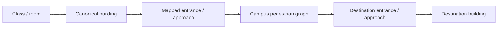

<div align="center">


# Gapwise for UTM

### Make every gap on campus count.

**A privacy-first timetable, gap planner, and campus navigation experience built specifically for University of Toronto Mississauga students.**

[](https://gapwise.ca)
[](https://github.com/andrewmuratov/gapwise/actions/workflows/ci.yml)
[](LICENSE)

<sub>React 19 · TypeScript · TanStack Router · MapLibre · Supabase · Bun · Vercel</sub>

<br />

**[Live app](https://gapwise.ca)** · **[Privacy](PRIVACY.md)** · **[Security](SECURITY.md)** · **[Contributing](CONTRIBUTING.md)** · **[Campus map geometry](docs/CAMPUS_MAP_GEOMETRY.md)** · **[Campus survey](docs/CAMPUS_SURVEY.md)**

</div>

---

## What Gapwise does

UTM schedules are full of small decisions: **what is next, when should I leave, where should I go, and what can I realistically do with the time between classes?**

Gapwise turns an ACORN `.ics` export into a usable student-day system. It parses the timetable locally, identifies gaps, builds a day sequence, adds route-aware context, and lets students explore the UTM campus without manually rebuilding their schedule.

> **Import once. Understand the whole day.**

<table>
<tr>
<td width="33%" valign="top">

### 01 · Import
Drop in an ACORN `.ics` file or try the demo. Parsing happens locally in the browser.

</td>
<td width="33%" valign="top">

### 02 · Understand
See classes, gaps, leave-by guidance, route context, and usable time windows at a glance.

</td>
<td width="33%" valign="top">

### 03 · Move
Explore canonical UTM building geometry, mapped entrances, commute arrival points, and source-backed campus routes.

</td>
</tr>
</table>

---

## Current product surface

| | Experience |
|---|---|
| 📅 | **ACORN timetable import** — browser-local `.ics` parsing with weekly and mobile day views, plus a demo path for first-time exploration. |
| 🕒 | **Today / day sequence** — current and next class context, gap state, leave-by guidance, and direct route actions. |
| ⏳ | **Gap Plan** — evaluates usable gap time with route-aware recommendations instead of treating the timetable as a static grid. |
| 🗺️ | **UTM campus explorer** — searchable, deep-linkable MapLibre map with exact canonical building footprints, independent of basemap identity. |
| 🧭 | **Campus routing** — deterministic outdoor paths with entrance-level endpoints and explicit confidence instead of invented routes. |
| 📍 | **Opt-in live location** — same-origin geolocation can place the student on the campus map without background tracking. |
| 🚌 | **Commute-aware arrival** — source-backed UTM transit and parking arrival points can act as day-route origins for commuters. |
| 🏠 | **Residence-aware planning** — residence students can use their residence building as an origin and receive realistic round-trip gap suggestions when time permits. |
| 👥 | **Private friend overlap** — reveals limited mutual free windows without exposing either person's timetable. |
| ☁️ | **Optional encrypted sync** — restore private state across devices without making cloud storage mandatory. |
| 🔐 | **Google, Microsoft, and GitHub sign-in** — OAuth is optional; guest mode remains a first-class experience. |
| ♿ | **Accessible interaction** — keyboard navigation, reduced-motion behavior, screen-reader semantics, map alternatives, and light/dark themes. |
| 📱 | **PWA / mobile use** — installable, responsive, and designed around actual on-campus phone use rather than desktop-only layouts. |

---

## Campus map: exact identity, not proximity guessing

The interactive map no longer decides which building a student clicked by looking for the nearest entrance or whichever basemap polygon happens to be nearby.

`src/data/utm/building-footprints.ts` is the authoritative building-identity layer. Every recognized building owns an explicit `Polygon` or `MultiPolygon`, and the same canonical geometry drives:

1. pointer hover,
2. click/tap selection,
3. selected and hovered highlighting,
4. search-camera focus.

If a point belongs to no canonical footprint, Gapwise selects nothing. If it belongs to more than one, Gapwise also selects nothing and treats the ambiguity as a data problem to fix explicitly.

This matters around dense UTM clusters where nearest-feature heuristics can select the wrong structure. Erindale Hall, Erindale Studio Theatre, William G. Davis Building, Kaneff Centre / Innovation Complex, and other close geometries are deliberately kept distinct.

The basemap is **visual context only**. Entrances are **routing data only**. Neither is allowed to silently redefine building identity.

See [`docs/CAMPUS_MAP_GEOMETRY.md`](docs/CAMPUS_MAP_GEOMETRY.md) for provenance, source IDs, regression rules, and the future 3D integration contract.

---

## Campus-bounded exploration

Gapwise uses the same routing-derived campus region for live-location presence checks and map constraints.

The map therefore:

- constrains panning to the UTM campus region,
- disables world copies,
- keeps overview/reset actions campus-scaled,
- supports smooth building-focused search without scrolling the page,
- fits the exact selected footprint together with its known entrances,
- preserves reduced-motion behavior for users who request it.

The goal is to feel like a UTM navigation surface, not a generic world map with a marker dropped on campus.

---

## Routing model

Gapwise deliberately separates **visual geography**, **building identity**, and **navigation evidence**.



For commuters, the first node can instead be a source-backed campus arrival point such as the UTM MiWay station, the UTM Shuttle stop at Instructional Centre, or a mapped parking lot.

Route confidence is explicit:

- **Verified** — source evidence identifies the entrance or routing point.
- **Inferred** — a mapped pedestrian approach is used because a verified public door point is not available.
- **Approximate** — a clearly labelled fallback where the product can support only approximate guidance.
- **Unavailable** — Gapwise refuses to invent a route it cannot justify.

Indoor room routing is intentionally conservative. Basemap geometry is never treated as proof of a real indoor corridor, staircase, elevator, or doorway. If a verified indoor route is not available, the interface says so.

---

## 3D building architecture

Gapwise is prepared for real georeferenced 3D campus models without making them part of building identity.

`src/data/utm/campus-models.ts` defines the integration contract for local GLB/GLTF models keyed to canonical building codes. A future model can carry a verified WGS84 anchor, altitude, rotation, scale, provenance, licence, and verification state while the canonical footprint remains authoritative for hit-testing.

Expected layer order:

1. basemap / visual context,
2. canonical footprint interaction layer,
3. optional georeferenced GLB/GLTF custom layer sharing the MapLibre camera/depth buffer,
4. Gapwise routes, entrances, and live-location markers.

The intended model pipeline is open-data and local-first; Gapwise does not copy proprietary Concept3D model assets.

---

## Privacy is an architecture decision

The **original ACORN `.ics` file never leaves the browser**.

```text
ACORN .ics
    │
    ▼
Browser parsing ──────► timetable + gaps + routes
    │
    ├── guest mode ───► stays local
    │
    └── optional sync
            │
            ▼
      browser encryption
            │
            ▼
         Supabase
       (ciphertext +
      minimal metadata)
```

### What that means in practice

- The original `.ics` file is parsed locally and is never uploaded.
- Campus route calculation uses bundled/reviewed routing data rather than a paid third-party routing provider.
- Live location is opt-in and is not background-tracked.
- Cloud sync is optional.
- The browser encrypts the full private payload before it reaches Supabase.
- Friend availability is represented separately as a deliberately lossy encrypted capsule.
- Friends can receive at most three mutual rounded windows for a selected term — **not** a timetable, course list, room list, building history, or arbitrary availability probe.
- A valid encrypted local copy can restore before the network path and routine same-device reloads can decrypt locally.
- Signing out clears that signed-in user's local private state.
- There is no advertising.

Gapwise uses defense in depth; it does **not** claim end-to-end encryption or zero knowledge. Plaintext exists in the active browser, and the production Vercel key broker is inside the cryptographic trust boundary for key unwrapping.

For details, read the **[privacy notice](PRIVACY.md)**, **[security policy](SECURITY.md)**, **[private-cloud architecture](docs/PRIVATE_CLOUD_SECURITY_ARCHITECTURE.md)**, and **[migration/recovery runbook](docs/PRIVATE_CLOUD_MIGRATION_RUNBOOK.md)**.

---

## Private cloud sync

Signed-in users can optionally sync encrypted private state through Supabase. Authentication supports **Microsoft, Google, and GitHub OAuth**.

The browser keeps non-extractable data keys and encrypted private records in IndexedDB when durable `CryptoKey` cloning is supported. A normal reload can decrypt the local record without calling the key broker.

On a new device or after browser storage is cleared, sign-in allows the narrow broker to wrap the user's existing data keys to a new non-extractable device key; the browser then downloads ciphertext under Supabase Row Level Security and decrypts it locally.

Encrypted sync uses authenticated revisions and rejects stale writes instead of silently replacing newer cloud state. The encrypted local transaction is written first, so a Supabase or Vercel outage does not discard the valid local copy.

> **Guest mode is not a demo mode.** The core timetable, planning, campus map, and routing experience works without creating an account.

---

## Account and data deletion

From the signed-in account menu, choose **Delete account and cloud data**.

One confirmation permanently removes the Supabase authentication account and user-owned application records through database cascades. The client also removes that user's local keys, ciphertext, remembered private state, and decrypted UI state from the current browser.

The original `.ics` file was never uploaded in the first place.

**Account deletion is permanent.**

---

## Tech stack

<div align="center">


</div>

Core runtime and infrastructure currently include React 19.2, TypeScript, TanStack Router/Start, Vite 8, MapLibre GL 6, Supabase, Bun 1.3.14, Tailwind CSS 4, Playwright, Vercel Analytics, and Vercel Speed Insights.

---

## Run it locally

### Requirements

- **Bun 1.3.14**
- **Node 24.x** where Node tooling is required

```bash
git clone https://github.com/andrewmuratov/gapwise.git
cd gapwise
bun install --frozen-lockfile
bun run dev
```

The core guest experience works without backend configuration.

For optional Supabase-backed features, provide browser-safe values only:

```dotenv
VITE_SUPABASE_URL=https://your-project.supabase.co
VITE_SUPABASE_PUBLISHABLE_KEY=your-publishable-key
```

> [!WARNING]
> Never place a Supabase service-role key, OAuth client secret, server secret, or private key in a `VITE_` variable or commit it to the repository.

See **[operations](docs/OPERATIONS.md)**, **[Supabase setup](docs/SUPABASE.md)**, **[Vercel deployment](docs/VERCEL.md)**, and **[static guest fallback notes](docs/CLOUDFLARE_PAGES.md)**.

---

## Quality gates

The normal development checks are explicit:

```bash
bun run typecheck
bun run lint
bun test
bun run build
bun run format:check
bun run test:e2e
bun audit
```

The repository also contains dedicated regression coverage for:

- ACORN parsing and timetable restoration,
- gap assessment and residence behavior,
- campus-day and commute-origin routing,
- canonical UTM building footprints and overlap ambiguity,
- campus bounds and live-location presence,
- encrypted sync and private-data isolation,
- OAuth/account flows,
- browser accessibility and critical end-to-end product paths.

Brand assets are generated deterministically from canonical SVG sources:

```bash
bun run generate:icons
```

---

## Repository map

```text
src/
├── routes/          URL-driven application screens and shell
├── features/        auth, sync, security, social, gaps, routing
├── components/      timetable, Today, Gap Plan, route + accessible UI
└── data/utm/        canonical footprints, entrances, access points, graph data

api/                 same-origin Vercel server endpoints
supabase/            migrations + authenticated server functions
e2e/                 Playwright browser release/regression coverage
tests/               parser, routing, privacy, geometry, security, restoration
docs/                architecture, operations, campus data + deployment docs
scripts/             deterministic data-generation and review tooling
```

---

## Contributing campus data

Accurate campus navigation is built from reviewed evidence, not guesses.

If you want to improve entrances, approaches, routing, or indoor coverage:

1. Read [`docs/CAMPUS_SURVEY.md`](docs/CAMPUS_SURVEY.md).
2. Follow the canonical survey schema.
3. Record the source and confidence of every contribution.
4. Do not promote an inferred approach or estimate to a verified entrance without review.
5. Keep building identity separate from routing-point proximity.
6. Run `bun run routing:refresh` only when intentionally updating the dated OpenStreetMap routing snapshot.

For building footprint work, also read [`docs/CAMPUS_MAP_GEOMETRY.md`](docs/CAMPUS_MAP_GEOMETRY.md).

Contributions that improve **accuracy, accessibility, privacy, or resilience** are especially valuable.

---

## Deployment model

Production deploys from `main` to Vercel. `vercel.json` defines the application build, same-origin private-cloud functions, browser-history fallback, caching, and security headers. Supabase migrations and server functions are deployed separately.

Production private-cloud storage is encrypted-only: legacy plaintext timetable/settings storage and the old plaintext overlap implementation have been removed.

The static guest experience can also be hosted without a backend, preserving vendor portability and the project's free-for-students operating goal. That fallback does not provide private-cloud restoration or common-gap server features unless equivalent same-origin endpoints are implemented and reviewed.

---

## Current direction

Gapwise is past the stage where the goal is simply to add more features. Current work is deliberately evidence-driven:

- polish the first-run ACORN import and demo experience,
- keep the mobile Gap Plan and day-route experience result-first,
- run uncoached student usability sessions before broad promotion,
- expand the first **verified** UTM routing dataset rather than guessing broad coverage,
- add a lightweight route/campus-data correction loop,
- expand the complete building inventory and open-data 3D layer only when they are worth the added scope.

No paid map dependency. No background location tracking. No requirement to create an account. No upload of the original timetable file.

---

## Independent student project

> [!IMPORTANT]
> **Gapwise for UTM is an independent student project. It is not affiliated with, endorsed by, or an official service of the University of Toronto.**

---

## License

Original project code and documentation are available under the **[MIT License](LICENSE)**.

Third-party software, fonts, services, and OpenStreetMap-derived data remain subject to their own terms. See **[Third-party notices](THIRD_PARTY_NOTICES.md)**.

<br />

<div align="center">


**Built for the spaces between classes.**

[Open Gapwise →](https://gapwise.ca)

</div>
