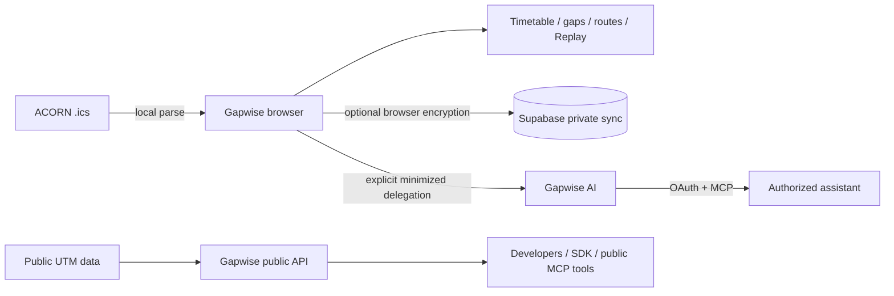

<div align="center">


# Gapwise for UTM

### Make every gap on campus count.

**A privacy-first student context and campus-intelligence platform built for University of Toronto Mississauga.**

[](https://gapwise.ca)
[](https://github.com/andrewmuratov/gapwise/actions/workflows/ci.yml)
[](https://api.gapwise.ca/openapi.json)
[](LICENSE)

<sub>React 19 · TypeScript · TanStack Router/Start · MapLibre · Supabase · Bun · Vercel · Cloudflare · Resend</sub>

<br />

**[Live app](https://gapwise.ca)** · **[Today](https://gapwise.ca/today)** · **[Day Replay](https://gapwise.ca/replay)** · **[Developers](https://gapwise.ca/developers)** · **[Docs](https://docs.gapwise.ca)** · **[Status](https://status.gapwise.ca)** · **[OpenAPI](https://api.gapwise.ca/openapi.json)**

</div>

---

## What Gapwise is

Gapwise turns a UTM ACORN `.ics` timetable export into a local-first system for understanding a student's day: **what is next, where do I need to go, when should I leave, and what can I realistically do with the time between classes?**

The original calendar file is parsed entirely in the browser. From that normalized schedule, Gapwise builds timetable views, detects gaps, computes route-aware activity budgets, produces leave-by timing, and renders campus navigation without requiring an account.

The product now spans six connected first-party surfaces:

| Surface | Purpose |
| --- | --- |
| **Student web/PWA** | Timetable, Today, gap planning, campus routing, destination feasibility, encrypted sync, and Day Replay |
| **Gapwise Platform** | Public UTM building/routing/gap API, OpenAPI 3.1 contract, SDK source, and versioned open campus snapshot |
| **Gapwise Mobile** | Native iOS and Android client consuming canonical Gapwise product and platform semantics |
| **Gapwise AI** | Optional permissioned MCP access to explicitly delegated student context plus bounded AI-facing actions |
| **Gapwise Docs** | Public documentation for the API, SDKs, platform behavior, and AI/MCP integration |
| **Gapwise Status** | Operator-maintained current service-status communication at `status.gapwise.ca`; it is not a continuous synthetic monitor, historical uptime record, or SLA |

The architectural rule is simple: **Gapwise owns the facts and deterministic calculations. Interfaces—including mobile and AI assistants—consume that truth rather than recreating it, while the docs describe released public behavior.**

---

## Student experience

### ACORN import

- Import a UTM ACORN `.ics` export directly in the browser.
- The raw calendar file is never uploaded to Gapwise.
- Canonical course-title enrichment sends only three-letter subject prefixes such as `CSC` or `MAT` to Gapwise; the raw `.ics` and exact course list remain local, and ACORN's exported title remains the fallback if lookup is unavailable.
- Guest mode is first-class; an account is not required for the core app.
- A synthetic demo timetable is available for trying the product without personal data.

### Today

Today turns the current schedule state into an actionable view:

- current and next class context;
- current gap and deterministic recommendation;
- route state, travel time, protected transition buffer, and leave-by timing;
- direct navigation actions;
- safe handling of unknown, online, TBA, approximate, and inaccessible/unverified routing states.

### “Can I go there?”

During a bounded gap, a student can choose a canonical UTM building and ask whether a visit is actually feasible before the next class.

Gapwise evaluates both legs:

```text
previous class → chosen building → next class
```

The result accounts for travel, transition protection, setup/pack-up overhead, usable destination time, latest leave time, route confidence, and warnings. Same-building results are building-level only; Gapwise does not pretend it has room-to-room indoor routing where it does not.

### Timetable + gap planning

The timetable is not only a calendar renderer. Gapwise derives the spaces between classes and runs deterministic gap assessment using schedule boundaries, routing, user preferences, protected buffers, and uncertainty.

Recommendations can distinguish short transitions, reset windows, focus/study blocks, meals, longer flexible gaps, and commute/home candidates without asking an LLM to perform timetable arithmetic.

### Campus map and Day Route

Gapwise uses a canonical UTM building registry, mapped/inferred entrances, and a deterministic routing graph to present a chronological campus day.

- class markers carry actual timetable times;
- route segments progress through the day in order;
- route arrival entrances remain distinct from building identity;
- commute origins can represent residence, transit, parking, or pickup/drop-off;
- foreground live location is optional and never background-tracked;
- step-free routing fails closed when a verified accessible route is unavailable.

### Day Replay

**[Day Replay](https://gapwise.ca/replay)** simulates a selected campus day entirely in the browser.

Use the synthetic demo schedule or import an `.ics` locally, then scrub or play through:

- classes;
- gaps and transitions;
- route progression;
- deterministic gap recommendations;
- usable time;
- leave-by/arrival timing;
- routed, approximate, same-building, and unavailable states.

No replay-specific database, worker, cron job, hosted model, or timetable upload is required.

---

## Gapwise Platform

Gapwise exposes a deliberately small public campus-intelligence surface for UTM projects. The canonical base URL is `https://api.gapwise.ca/v1`; visiting the API hostname root redirects to `/v1`, while existing `/api/utm-*` routes on `gapwise.ca` remain compatibility aliases. It uses the same deterministic building, routing, and gap-planning semantics as the product rather than maintaining a second implementation.

### Developer resources

- **Developer hub:** https://gapwise.ca/developers
- **Developer documentation:** https://docs.gapwise.ca
- **Canonical API:** https://api.gapwise.ca/v1
- **OpenAPI 3.1:** https://api.gapwise.ca/openapi.json
- **Versioned UTM snapshot:** https://gapwise.ca/data/utm-campus-v1.json
- **JavaScript/TypeScript SDK source:** [`sdk/javascript`](sdk/javascript)
- **Python SDK source:** [`sdk/python`](sdk/python)
- **Platform documentation:** [`docs/DEVELOPER_PLATFORM.md`](docs/DEVELOPER_PLATFORM.md)

### Public API

| Method | Path | Purpose |
| --- | --- | --- |
| `GET` | `/v1` | API/data version and privacy metadata |
| `GET` | `/v1/buildings` | Canonical UTM building inventory, routing coverage, accessibility state, and provenance |
| `GET` | `/v1/buildings/MN` | Resolve one building by canonical code, official name, or known alias |
| `GET` | `/v1/places` | Canonical campus places, freshness, and provenance |
| `GET` | `/v1/places/:placeId` | Resolve one campus place |
| `POST` | `/v1/routes` | Deterministic building-to-building routing |
| `POST` | `/v1/gaps/plan` | Deterministic route-aware gap assessment for an explicit free window |

The public API is campus-only. It does **not** expose student timetables, accounts, friends, credentials, private sync state, AI delegation, or precise live location.

### Official SDKs

The TypeScript-first [`@gapwise/sdk`](sdk/javascript) and typed synchronous/asynchronous Python [`gapwise`](sdk/python) clients share the canonical v1 semantics. `@gapwise/sdk@0.1.0` is published on npm with provenance; the Python package is still awaiting its first verified PyPI release. Both support building/place discovery, routing, explicit free-interval planning, typed errors, timeouts, custom endpoints, and deterministic mocked tests.

```bash
npm install @gapwise/sdk@0.1.0
```

```ts
import { Gapwise } from "@gapwise/sdk";
const gapwise = new Gapwise();
const places = await gapwise.places.list({ building: "HM", openNow: "unknown" });
```

See the [developer-platform guide](docs/DEVELOPER_PLATFORM.md) for authentication, filtering, response envelopes, errors, abuse protection, provenance, uncertainty, versioning, examples, and legacy migration.

### Open UTM data

The current public snapshot contains **30 canonical UTM buildings/facilities** with identity, aliases, routing-coverage state, entrance-count summaries, accessibility state, and normalized provenance.

Gapwise source code is MIT licensed, but upstream data retains its own terms. OpenStreetMap-derived records require OpenStreetMap attribution and ODbL compliance; the MIT license does not override those obligations.

---

## Gapwise AI

Gapwise AI is a separate provider-neutral **Model Context Protocol (MCP)** service at:

```text
https://ai.gapwise.ca/api/mcp
```

It exists so an authorized assistant can use exact Gapwise context without receiving unrestricted access to a student's account or becoming the source of truth for schedule/routing calculations.

### Grounding model

```text
Gapwise deterministic truth                    Assistant
──────────────────────────                    ─────────
schedule facts            ─┐
gap assessments           ─┼─> permissioned MCP ─> reasoning / advice
routing + uncertainty     ─┤
public campus data        ─┘
```

Assistant advice and inference are deliberately distinct from values supplied by Gapwise. An assistant may reason over a returned route or gap plan; it should not relabel its own estimate as a Gapwise fact.

### Delegation and privacy boundary

AI access is **explicit opt-in and separate from OAuth sign-in**. Demo schedules are never delegated.

When a signed-in user enables AI access, Gapwise publishes only the minimized categories that the integration is designed to share. The UI exposes separate controls for personal items, gap plans/preferences, routing preferences, and bounded personal/preference writes.

The delegated snapshot excludes:

- the raw ACORN `.ics` file;
- friend data;
- precise/live location;
- account credentials;
- Gapwise private-data encryption keys;
- unrelated browser state.

Academic meetings are always **read-only** to AI. Personal-item and gap-preference changes are typed, permission-checked, revision-bound, idempotency-bounded, and queued for Gapwise rather than allowing an MCP client to arbitrarily rewrite the primary timetable payload.

Gapwise AI is **not** zero-knowledge: authorized plaintext exists transiently in the service when a private tool needs to answer an authorized request. Its delegated data is encrypted at rest with a separate key domain, and the MCP runtime does not require a Supabase service-role key.

> **External-client status:** the production MCP service and public `gapwise-ai` repository are live, and the production OAuth 2.1 consent/resource boundary has been validated. Broad-client release readiness remains evidence-gated on the real Claude and ChatGPT read/write/revoke matrices, production-equivalent negative/re-auth cases, and the final post-matrix exact-head verification. Do not represent universal external-client support before those gates pass.

---

## Deterministic by design

Gapwise deliberately does not make an LLM responsible for the calculations that define whether a student can physically make the next class.

Deterministic domain logic owns:

- calendar normalization and recurrence;
- class/gap boundary arithmetic;
- building identity resolution;
- campus routing;
- walking-time estimation;
- transition buffers;
- gap activity budgets;
- “Can I go there?” feasibility;
- leave-by and arrival timing;
- route verification/accessibility uncertainty.

React renders these decisions. The public API exposes them. Gapwise AI consumes them. None of those surfaces should silently implement a separate version of the same math.

---

## Routing and uncertainty

Gapwise separates **building identity**, **visual geography**, and **navigation evidence**.

Canonical building identity comes from the reviewed UTM registry in `src/data/utm/`. Route coverage then carries explicit confidence instead of silently treating every building pair as equally known.

Typical states include:

- **routed / verified or mixed** — an evidence-backed mapped path is available;
- **approximate / inferred** — useful guidance exists, but its limits remain visible;
- **same-building** — no building-to-building leg is required; this is not a room-to-room claim;
- **unavailable** — Gapwise does not have enough justified routing evidence and refuses to invent a path.

Accessibility uncertainty is preserved through UI, API, Replay, and AI surfaces. In step-free mode, missing accessible evidence fails closed.

See [`docs/CAMPUS_MAP_GEOMETRY.md`](docs/CAMPUS_MAP_GEOMETRY.md), [`docs/CAMPUS_SURVEY.md`](docs/CAMPUS_SURVEY.md), and [`docs/DEVELOPER_PLATFORM.md`](docs/DEVELOPER_PLATFORM.md).

---

## Privacy and security

The **original ACORN `.ics` file never leaves the browser**.



Key properties:

- guest mode and local timetable parsing are first-class;
- cloud sync is optional;
- private sync payloads are encrypted in the browser before storage;
- live location is opt-in and foreground-only;
- friend overlap is deliberately lossy and separate from raw timetable sharing;
- AI delegation is explicit, minimized, revocable, and separate from ordinary sign-in;
- the visible sign-in experience is OAuth-based, while Supabase Auth is protected by Cloudflare Turnstile at the auth-service boundary;
- no advertising and no raw timetable/location/friend analytics;
- production and preview environments must never share a key-encryption key.

Gapwise uses defense in depth and documents its trust boundaries precisely. It does **not** claim zero knowledge or end-to-end encryption for every feature.

Read [`PRIVACY.md`](PRIVACY.md), [`SECURITY.md`](SECURITY.md), and [`docs/PRIVATE_CLOUD_SECURITY_ARCHITECTURE.md`](docs/PRIVATE_CLOUD_SECURITY_ARCHITECTURE.md).

### Production infrastructure and communications

The public web surfaces are served by Vercel. Cloudflare is used for the `gapwise.ca` domain/DNS layer, inbound Email Routing, and Turnstile abuse protection; this documentation does not imply that Cloudflare proxies the Vercel application traffic.

Production communication boundaries are intentionally separated:

- `security@gapwise.ca` is the canonical vulnerability-reporting email and is published in `/.well-known/security.txt` and [`SECURITY.md`](SECURITY.md);
- `support@gapwise.ca` and `hello@gapwise.ca` are branded inbound aliases routed through Cloudflare Email Routing;
- `auth.gapwise.ca` is the verified Resend sending domain used by Supabase custom SMTP for authentication mail;
- Resend credentials are server/dashboard secrets and are never committed to this repository;
- [status.gapwise.ca](https://status.gapwise.ca) is hosted separately from the core app inside the docs deployment, so it remains a distinct communication surface; its content is operator-maintained rather than continuous uptime telemetry.

Web product telemetry uses **Vercel Analytics and Speed Insights**. Gapwise does not currently load a second Cloudflare Web Analytics beacon, avoiding duplicate telemetry and an unnecessary expansion of the production Content Security Policy.

---

## Tech stack

- **React 19.2** + TypeScript 5.8
- **TanStack Router / Start**
- **Vite 8**
- **Tailwind CSS 4**
- **MapLibre GL 6**
- **Supabase Auth / Postgres / RLS**
- **Bun 1.3.14**
- **Playwright** + axe-core browser coverage
- **Vercel** + Analytics / Speed Insights
- **Cloudflare** domain/DNS, Email Routing, and Turnstile
- **Resend** custom SMTP delivery for Supabase Auth
- **GitHub Actions**

`package.json` and `bun.lock` are the source of truth for exact dependency versions. Node-based tooling targets **Node 24.x**.

---

## Run locally

Requirements:

- **Bun 1.3.14**
- **Node 24.x** where Node-based tooling is required

```bash
git clone https://github.com/andrewmuratov/gapwise.git
cd gapwise
bun install --frozen-lockfile
bun run dev
```

Guest mode works without backend configuration.

Optional Supabase-backed features use browser-safe variables only:

```dotenv
VITE_SUPABASE_URL=https://your-project.supabase.co
VITE_SUPABASE_PUBLISHABLE_KEY=your-publishable-key
```

Never place a service-role key, OAuth client secret, SMTP/API credential, KEK, private key, or other server secret in a `VITE_` variable.

---

## Verification

Normal release gates:

```bash
bun run typecheck
bun run lint
bun test
bun run build
bun run format:check
bun run test:e2e
```

Database/security changes also require the isolated Supabase checks documented in [`docs/OPERATIONS.md`](docs/OPERATIONS.md).

Regression coverage includes ACORN parsing/restoration, onboarding, Today/gap planning, destination feasibility, routing/geometry, Day Replay, public platform assets/SDK behavior, encrypted sync and user isolation, OAuth/account flows, accessibility, PWA behavior, and desktop/mobile/iPad browser journeys.

`main` is production. Focused changes go through pull requests and should not reach `main` until the relevant release gates are green.

---

## Current release — September 1, 2026

The current production release includes:

- Gapwise Platform and the public UTM campus API, with `api.gapwise.ca/` routing users to the versioned `/v1` API root;
- OpenAPI 3.1, the published `@gapwise/sdk@0.1.0` npm client, Python SDK source, and the versioned 30-building snapshot;
- browser-side Day Replay;
- deterministic “Can I go there?” destination feasibility on Today, including the mobile surface;
- privacy-preserving canonical U of T course-title enrichment with local ACORN-title fallback;
- the permissioned Gapwise AI integration surface and provider-neutral MCP service, with the production OAuth consent/resource boundary validated;
- canonical `gapwise.ca` routing from `www.gapwise.ca` and the legacy `gapwise-utm.vercel.app` hostname;
- branded `security@`, `support@`, and `hello@` inbound mail, plus Resend-backed Supabase Auth SMTP on `auth.gapwise.ca`;
- Cloudflare Turnstile protection at the Supabase Auth boundary and the separate operator-maintained [Gapwise Status](https://status.gapwise.ca) surface;
- Vercel Analytics/Speed Insights as the active web telemetry implementation, without a duplicate Cloudflare analytics beacon;
- the public Trust Center/governance material, production-hardening campaign, security contact publication, and hosted-log credential-redaction hardening.

The immediate focus is **release validation, not feature expansion**: clean-device account continuity/encrypted restore, first PyPI publication and clean-install verification, physical UTM entrance/accessibility evidence, the database restore drill, real-device/student validation, and completion of the remaining external AI-client read/write/revoke and negative-path matrices.

---

## Repository map

```text
src/                 app routes, features, domain logic, UTM data, privacy/security
api/                 bounded public and authenticated Vercel server endpoints
public/              static OpenAPI, SDK and versioned public data assets
supabase/            migrations and authenticated database/server functions
e2e/                 Playwright release and regression journeys
tests/               unit/integration/security/contract regression coverage
docs/                architecture, operations, platform and campus-data docs
scripts/             deterministic generation/import/review tooling
```

---

## Gapwise ecosystem

The first-party repositories are separate deployment surfaces with one product identity, trust model, and source-of-truth hierarchy:

| Repository | Role | Primary surface |
| --- | --- | --- |
| **[`gapwise`](https://github.com/andrewmuratov/gapwise)** | Core web/PWA product, canonical student-state behavior, deterministic UTM campus intelligence, public API, OpenAPI contract, and SDK source | [gapwise.ca](https://gapwise.ca) / [api.gapwise.ca](https://api.gapwise.ca/v1) |
| **[`gapwise-mobile`](https://github.com/andrewmuratov/gapwise-mobile)** | Native iOS and Android client consuming canonical Gapwise contracts and product semantics | Native mobile app |
| **[`gapwise-ai`](https://github.com/andrewmuratov/gapwise-ai)** | Permissioned OAuth/MCP layer for explicitly delegated student context and bounded AI actions | [ai.gapwise.ca](https://ai.gapwise.ca/api/mcp) |
| **[`gapwise-docs`](https://github.com/andrewmuratov/gapwise-docs)** | Public developer documentation plus the separate operator-maintained status communication surface | [docs.gapwise.ca](https://docs.gapwise.ca) / [status.gapwise.ca](https://status.gapwise.ca) |

This repository remains authoritative for deterministic timetable, gap, campus, routing, and primary student-state semantics. Mobile and AI consume its contracts rather than becoming parallel sources of truth; the docs describe released public behavior. All four repositories should keep cross-links, terminology, trust boundaries, and brand presentation consistent.

---

## Contributing

Contributions are welcome. Read [`CONTRIBUTING.md`](CONTRIBUTING.md) before opening a pull request. Report vulnerabilities privately to `security@gapwise.ca` or through GitHub private vulnerability reporting as described in [`SECURITY.md`](SECURITY.md), rather than in a public issue.

## Independent student project

> [!IMPORTANT]
> **Gapwise for UTM is an independent student project. It is not affiliated with, endorsed by, or an official service of the University of Toronto.**

## License

Original project code and documentation are available under the **[MIT License](LICENSE)**. Third-party software, fonts, services, and OpenStreetMap-derived data remain subject to their own terms; see [`THIRD_PARTY_NOTICES.md`](THIRD_PARTY_NOTICES.md).

<div align="center">

**Built for the spaces between classes.**

[Open Gapwise →](https://gapwise.ca)

</div>